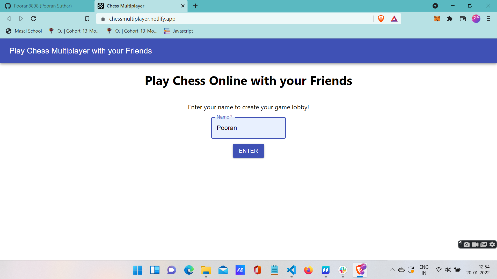
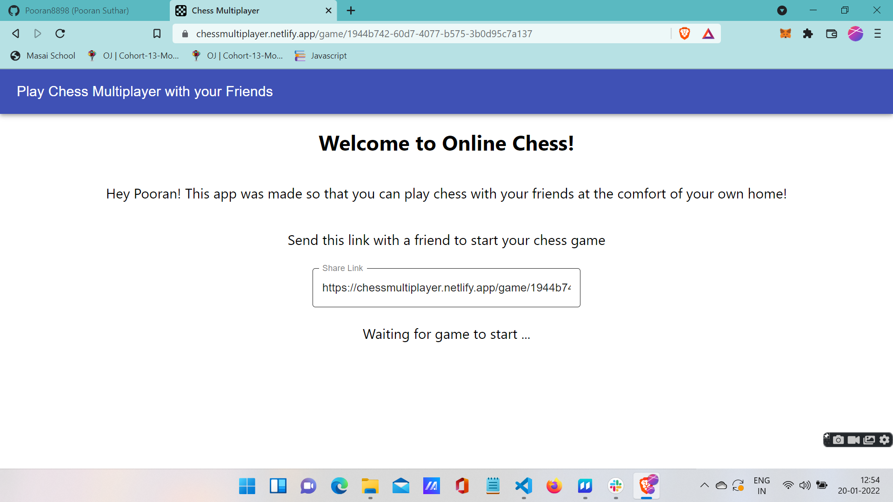
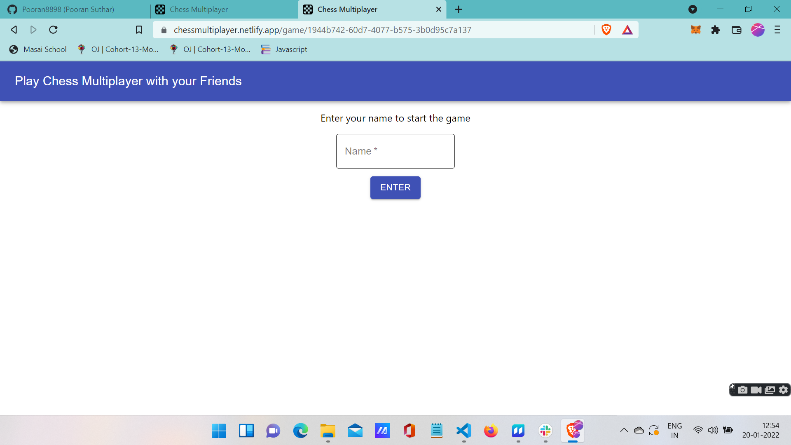
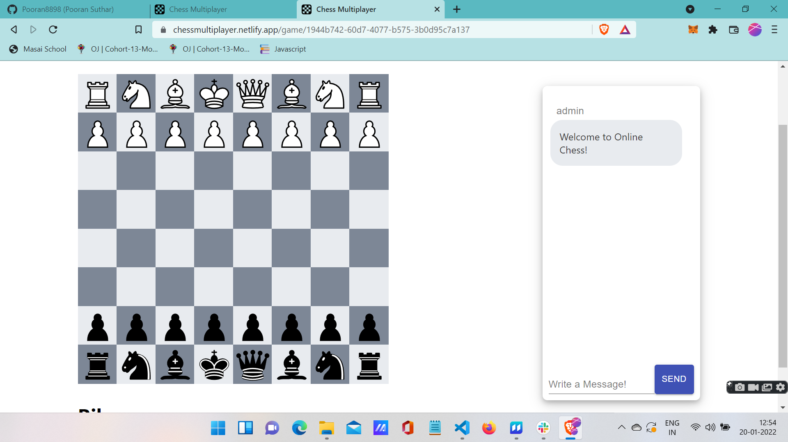
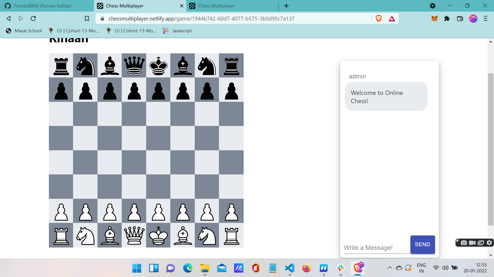
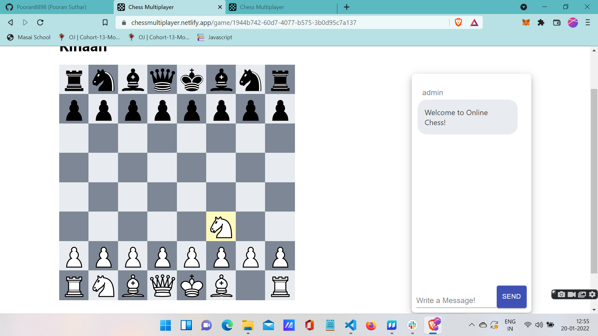
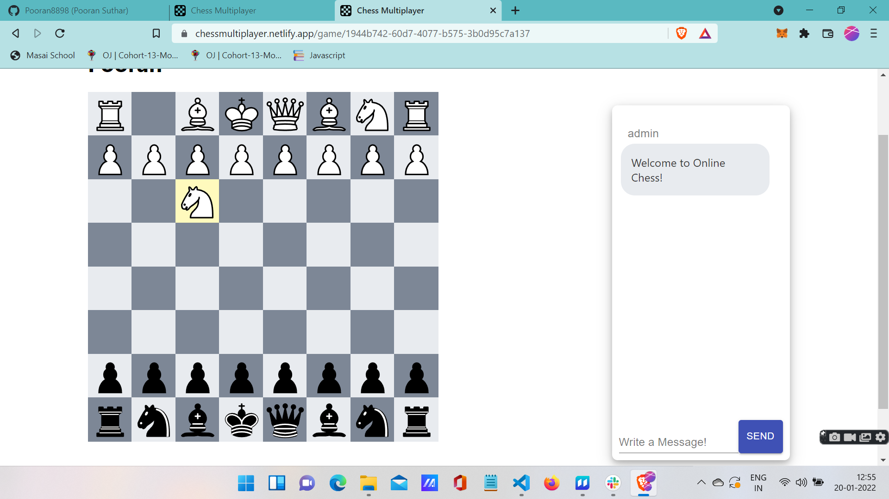
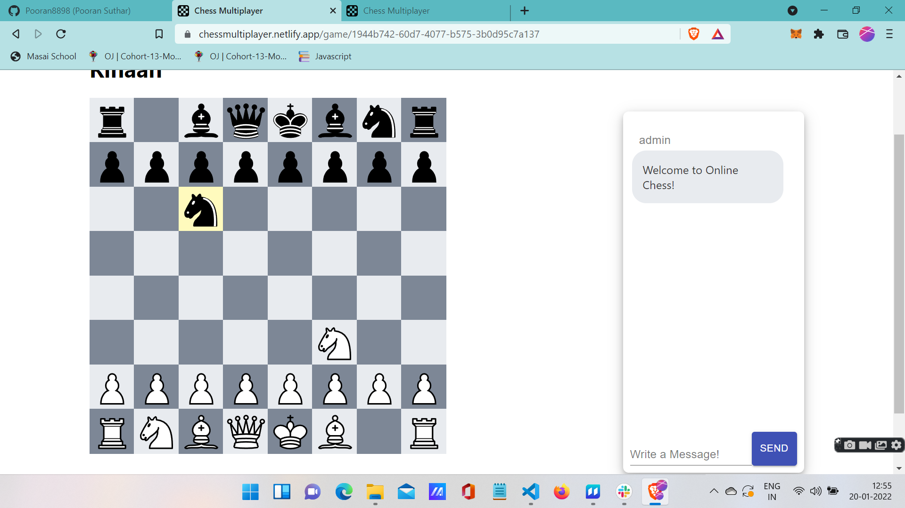
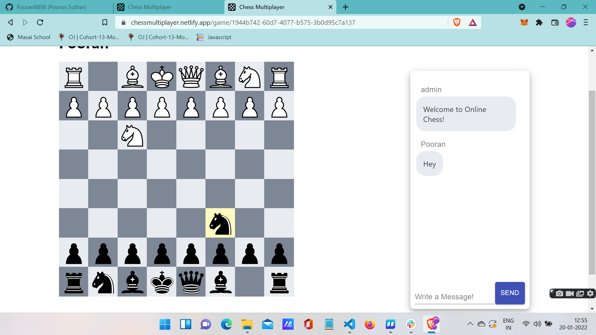

# Chess Multiplayer

### Chess Multiplayer is a website where you can play chess with your loved ones that are in any part of the world just by sharing a simple link.Also you can chat while playing chess.

# Technologies used
* [React]
* [express]
* [socket.io]
* [material-ui]
* [react-scroll-to-bottom]
* [socket.io-client]
* [use-sound]
* [uuid]

# [Demo Link](https://chessmultiplayer.netlify.app/)

# Steps to Browse the Projects
### 1.Clone the Repository in your PC then there will be two different files one of the client for Frontend and the other one server for the backend. After opening each of the file install all the dependencies that are required to run both the files.Then open two different terminal one for frontend ,one for backend and run npm start on both the terminal so the backend will run in terminal and frontend will run on localhost://3000. Enter the username
#

### 2. Now after entering the username and then click on Enter you will be redirected to a page where you will find the link to share with your friends and family members. So Copy that and share it.
#

### 3. After your friend has open the link it will ask him/her to enter the username. So enter the username and click on enter.
#

### 4. Now Both the Player1 and Player2 will have a chatbox and ChessBoard in front of their Screen. They will have ChessBoard different on their screen according to their colour.
#

#

### 5. Now the player who has started the game will be considered as player1 and he will have white colour and have the chance to play first.For the other player vice-versa. As the player1 moves one Piece the same will happen on the Player2 Screen. As you can see in the below Screenshot.
#

#

### 6. Now the playerturn is of Player2 and as soon as he moves one piece the same will happen for the player1 also. As you can see in the below image.
#

#

### 7. You can also chat and the messages will be instant delievered.
#

#### So this was our project I have created with my efforts. I have added the screensots for our audience to understand easily.

#### ## Thank you for giving it a read....

